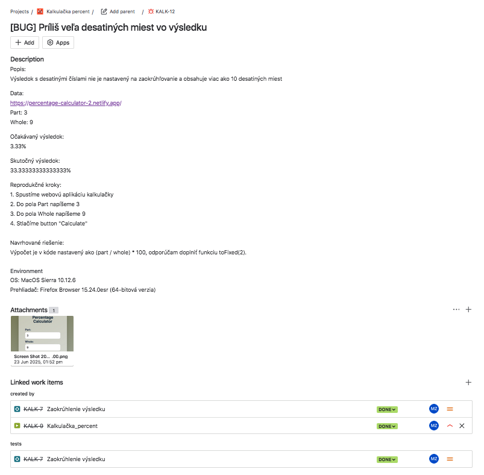
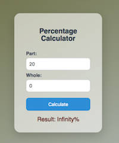

# Kalkulačka Percent – Bug reporty

## [BUG] – Príliš veľa desatinných miest vo výsledku

**Súvisiaci test:** TC_06  
**Priorita:** Nízka  
**Závažnosť:** Stredná

**Popis:**
- Výsledok s desatinnými číslami nie je nastavený na zaokrúhľovanie a obsahuje viac ako 10 desatinných miest.

**Očakávaný výsledok:**  
- Zobrazí sa zaokrúhlený výsledok na 2 desatiné miesta (napr. 3.33%)

**Skutočný výsledok:**  
- Zobrazí sa výsledok s nadbytočným množstvom desatinných miest (napr. 33.33333333333333%)

**Kroky na reprodukciu:**  

  1. Spustíme webovú aplikáciu kalkulačky  
  2. Do poľa "Part" napíšeme 3  
  3. Do poľa "Whole" napíšeme 9  
  4. Stlačíme tlačidlo "Calculate"

**Navrhované riešenie:**
  - Výpočet je v kóde nastavený ako (part / whole) * 100, odporúčam doplniť funkciu toFixed(2).

**Environment:**

- OS: MacOs Sierra 10.12.6
- Prehliadač: Firefox Browser 15.24.0esr (64-bit)

**Dôkaz:**  
  
  
  

**Príloha [JIRA / Xray]:**  

  

---

## [BUG] – Kalkulačka zobrazuje "NaN%" pri nečíselných vstupoch

**Súvisiaci test:** TC-03 
**Priorita:** Stredná  
**Závažnosť:** Stredná

**Popis:**
- Pri zadaní nečíselných znakov do input polí "Part" a "Whole" sa po stlačení tlačidla "Calculate" nezobrazí korektné chybové hlásenie, ale výsledok "NaN%".

**Očakávaný výsledok:**  
- Zobrazí sa chybové hlásenie oznamujúce nutnosť zadania iba čísel do input polí

**Skutočný výsledok:** 
- Zobrazí sa výsledok "NaN%"

**Kroky na reprodukciu:**  

  1. Spustíme webovú aplikáciu kalkulačky  
  2. Do poľa "Part" napíšeme "#_"  
  3. Do poľa "Whole" napíšeme "ab"  
  4. Stlačíme tlačidlo "Calculate"

**Príloha [JIRA / Xray]:**  

  

---

## [BUG] – Pri delení nulou sa zobrazuje "Infinity%" namiesto chybového hlásenia

**Súvisiaci test:** TC-04  
**Priorita:** Vysoká  
**Závažnosť:** Vysoká

**Popis:**
- Po zadaní hodnoty 0 do poľa "Whole" a akejkoľvek hodnoty do poľa "Part" kalkulačka po stlačení "Calculate" zobrazí výsledok "Infinity%". Používateľ nedostane chybové hlásenie, že delenie nulou nie je povolené.

**Očakávaný výsledok:**  
- Zobrazí sa chybové hlásenie oznamujúce nemožnosť delenia nulou

**Skutočný výsledok:**  
- Zobrazí sa výsledok "Infinity%"

**Kroky na reprodukciu:**  

  1. Spustíme webovú aplikáciu kalkulačky  
  2. Do poľa "Part" napíšeme číslo 20  
  3. Do poľa "Whole" napíšeme číslo 0  
  4. Stlačíme tlačidlo "Calculate"

**Dôkaz:**  

---

## [BUG] – Kalkulačka zobrazuje "NaN%" pri prázdnych vstupoch

**Súvisiaci test:** TC-05  
**Priorita:** Stredná  
**Závažnosť:** Stredná

**Popis:**
- Keď sú obe vstupné polia "Part" a "Whole" ponechané prázdne a používateľ klikne na tlačidlo "Calculate", kalkulačka nezobrazí chybové hlásenie, ale zobrazí výsledok "NaN%".

**Očakávaný výsledok:**  
- Zobrazí sa chybové hlásenie oznamujúce nutnosť zadania čísel do polí

**Skutočný výsledok:**  
- Zobrazí sa výsledok "NaN%"

**Kroky na reprodukciu:**  

  1. Spustíme webovú aplikáciu kalkulačky  
  2. Polia "Part" a "Whole" necháme prázdne  
  3. Stlačíme tlačidlo "Calculate"

**Dôkaz:**  

---
