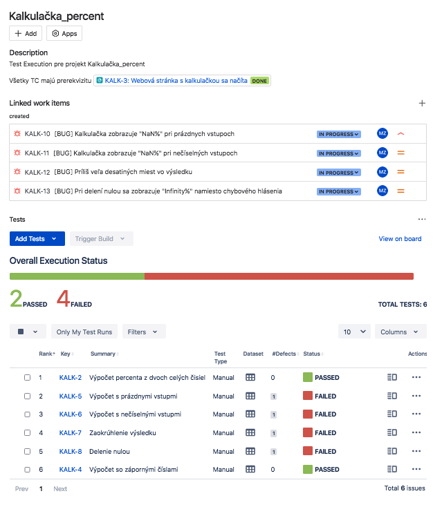
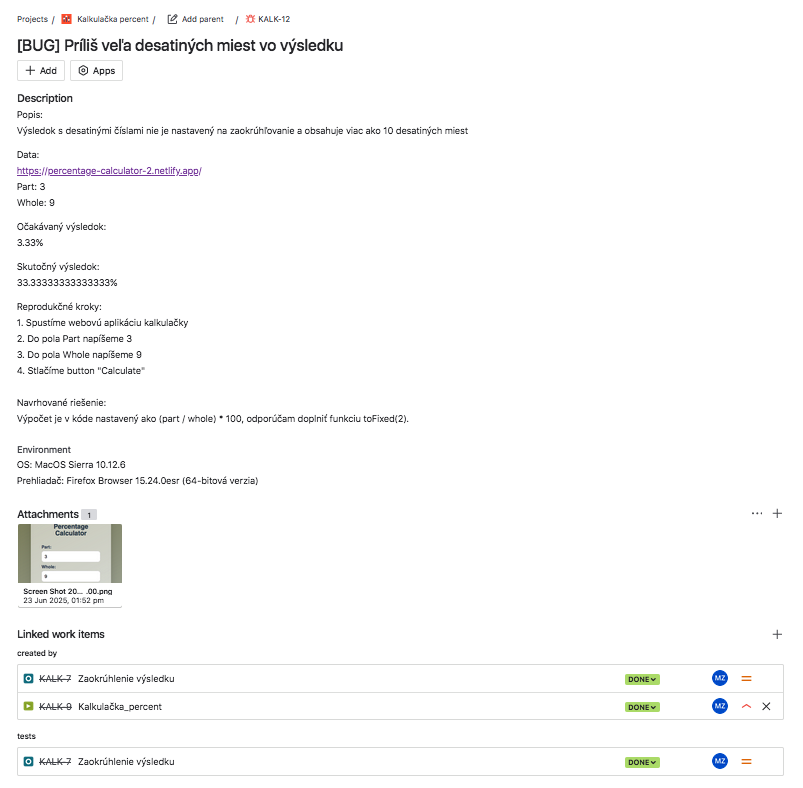

# Kalkulačka percent – QA Testing projekt

Tento projekt slúži ako ukážka manuálneho testovania webovej aplikácie – kalkulačky na výpočet percent. 

Zameriava sa na testovanie **UI**, **logiky výpočtu** a základných prvkov **UX**. Cieľom bolo odhaliť nedostatky v správaní aplikácie pri bežných aj hraničných vstupoch. 

Aplikáciu som vytvoril s pomocou ChatGPT a upravil do UI webovej podoby. V zadaní som zámerne príkázal implementovať chyby, ktoré následne slúžili ako predmet testovania a dokumentácie v bug reportoch.

---

## Zhrnutie projektu

- **Zameranie:** funkčné testovanie webovej aplikácie
- **Testovacie prípady:** 6 prípadov navrhnutých podľa špecifikovaných požiadaviek
- **Nájdené chyby:** 4 bugy s rôznou prioritou a závažnosťou
- **Použité nástroje:** JIRA / Xray, Markdown, manuálne testovanie, Visual Studio Code, Netlify, GitHub
- **Testovacie prostredie:** MacOS Sierra, Firefox ESR
- **Priložené súbory:**

  - [Testovacie prípady](./Kalkulacka_Percent_Testovacie_Pripady.md)
  - [Bug reporty](./Kalkulacka_Percent_Bug_Report.md)

---

## Odkaz na aplikáciu

Testovaná webová aplikácia bola dostupná na:  
[`https://percentage-calculator-2.netlify.app/`](https://percentage-calculator-2.netlify.app/)

---

## Ukážka testovacieho prípadu

```plaintext
estovací Prípad TC03 – Výpočet s nečíselnými vstupmi

Súvisiaca BR: BR-3  
Priorita:** Stredná  

PRE-REQ:
- Webová aplikácia kalkulačky je otvorená v prehliadači  

Data:
- https://percentage-calculator-2.netlify.app/
- Part: abc
- Whole: #

Kroky:
1. Do poľa "Part" zadaj text "#_" 
2. Do poľa "Whole" zadaj znak "ab"  
3. Klikni na tlačidlo "Calculate“

Očakávaný výsledok:
- Zobrazí sa chybové hlásenie "Prosím, zadajte číselné hodnoty"

Skutočný výsledok:
- Zobrazí sa "NaN%"

Stav:
Failed

Referencia na bug:
[BUG] – Kalkulačka zobrazuje "NaN%" pri nečíselných vstupoch

```

---

## Ukážka bug reportu

```plaintext
[BUG] – Príliš veľa desatinných miest vo výsledku

Súvisiaci test: TC_06 
Priorita: Nízka  
Závažnosť: Stredná

Popis:
- Výsledok s desatinnými číslami nie je nastavený na zaokrúhľovanie a obsahuje viac ako 10 desatinných miest.

Očakávaný výsledok:
- Zobrazí sa zaokrúhlený výsledok na 2 desatiné miesta (napr. 3.33%)

Skutočný výsledok:
- Zobrazí sa výsledok s nadbytočným množstvom desatinných miest (napr. 33.33333333333333%)

Kroky na reprodukciu:

  1. Spustíme webovú aplikáciu kalkulačky  
  2. Do poľa "Part" napíšeme 3  
  3. Do poľa "Whole" napíšeme 9  
  4. Stlačíme tlačidlo "Calculate"

Navrhované riešenie:
  - Výpočet je v kóde nastavený ako (part / whole) * 100, odporúčam doplniť funkciu toFixed(2).

Environment:

- OS: MacOs Sierra 10.12.6
- Prehliadač: Firefox Browser 15.24.0esr (64-bit)

Dôkaz:  
  
(./screenshots/KALK_Bug_desatine_miesta.png
```

---

## Business požiadavky (BR)

1. Kalkulačka správne vypočíta percento podielu (Part / Whole).
2. Kalkulačká správne počíta so zápornými číslami
3. Pri nečíselných vstupoch sa zobrazí chybové hlásenie.
4. Pri delení nulou sa zobrazí chybové hlásenie.
5. Prázdne vstupné polia spôsobia chybové hlásenie.
6. Výsledok má byť zaokrúhlený na max. 2 desatinné miesta.

---

## Ukážka práce v JIRA / Xray





---

## Odkazy

  - [Testovacie prípady (Markdown)](./Kalkulacka_Percent_Testovacie_Pripady.md)
  - [Bug reporty (Markdown)](./Kalkulacka_Percent_Bug_Report.md)

---

## Autor

**Marián Zavarský**   
GitHub: [github.com/tvoj_username](https://github.com/MarZav-5)  


---
