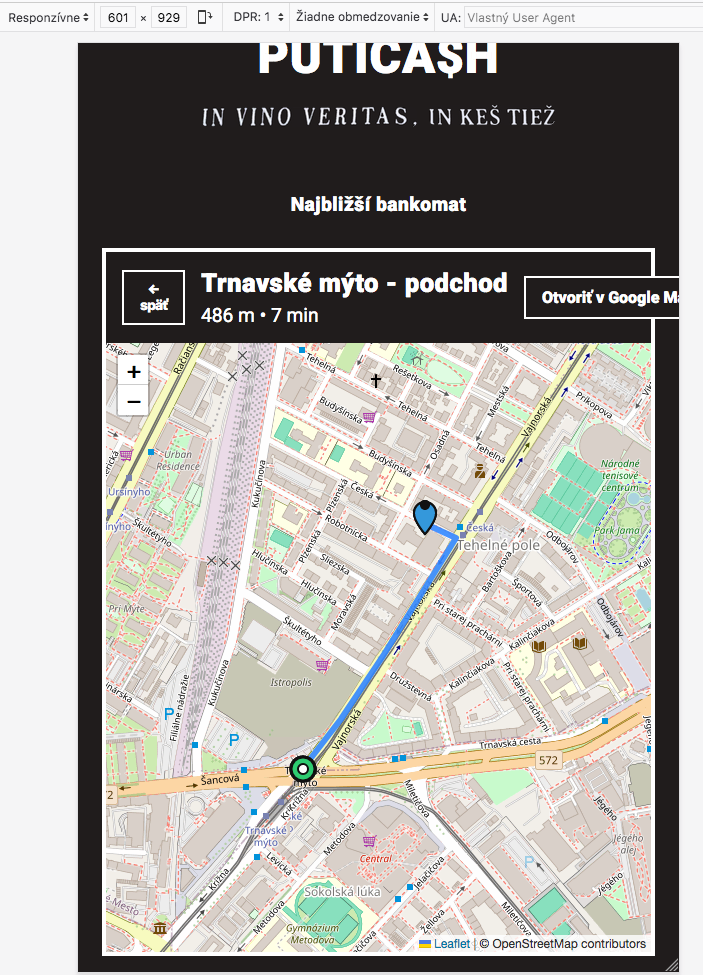

# PUTICA$H

Tento projekt demonštruje manuálne testovanie jednoduchej webovej aplikácie, ktorá umožňuje používateľovi vybrať bar/podnik, zobraziť najbližší bankomat (ATM) na mape a prostredníctvom Google Directions API získať pešiu trasu vrátane vzdialenosti a odhadovaného času. Aplikácia podporuje aj otvorenie trasy v Google Maps.

Aplikácia vznikla ako reakcia na dlhodobý problém nemožnosti platiť kartou v obľúbenom bratislavskom podniku a na časté situácie, keď si zákazník až pri platení uvedomí, že nemá hotovosť, a musí hľadať bankomat. Aplikácia preto zobrazuje najbližšie miesto na výber hotovosti v okolí daného podniku.

---

## Zhrnutie projektu

- **Zameranie:** funkčné smoke testovanie webovej aplikácie (zoznam barov, mapa, trasa, deeplink, fallback pri zlyhaní Directions, responzivita, API test)

- **Smoke suite:** 9 manuálnych testovacích prípadov

- **Nájdené bugy:** 3 – Funkčný (Chybná poloha ATM), responzivita (tlačidlo mimo kontajnera), UI/map rendering (markery zostávajú na mape)

- **Použité nástroje:** Google Cloud Console, Visual Studio Code, Netlify, GitHub

- **Testovacie prostredie:** macOS Sierra, Chrome / Firefox, localhost, Android

- **Priložené súbory:**
  - [Business Requirements](./business_requirements_list.md)
  - [Traceability Matrix](./traceability_matrix.md)
  - [Smoke Test Suite](./smoke_test_suite.md)
  - [Testovacie prípady](./smoke_test_cases.md)
  - [Bug report](./bug_report.md)

---

## Odkaz na aplikáciu

Testovaná webová aplikácia bola dostupná na:  
https://puticash.netlify.app/

---

## Ukážka testovacieho prípadu

```plaintext
Testovací Prípad SM-09
Názov: Reštrikcia API kľúča

Súvisiaca BR: BR–06

Priorita: Stredná

Popis:
Overenie, že Google Directions API kľúč je správne obmedzený iba na demo doménu (Netlify). Pri spustení aplikácie na inej doméne alebo v lokálnom prostredí (localhost) prestane Directions API fungovať. Aplikácia zobrazí chybové hlásenie a automaticky použije fallback výpočet vzdialenosti a času (haversine + odhad).
(Súvisiaci test: SM-04 – Fallback výpočet)

PRE-REQ:
- V Google Could Console je API kľuč Website restriction iba pre doménu Netlify
- Aplikácia je spustená na inej/nepovolenej doméne, príp. cez lokálne prostredie (localhost).

Test dáta:
- aplikácia na nepovolenej doméne / localhost

Kroky:
1. Spusť aplikáciu na nepovolenej doméne
2. Na úvodnom screene vyber ľubovoľný bar
3. Na mapovom screene over načítanie Leaflet mapy
4. Over zobrazenie chybovej hlášky v notice banneri (napr. Trasa API zlyhala…)
5. Over, že Directions polyline nie je vykreslená na mape
6. Over zobrazenie fallback výpočtu vzdialenosti (m/km) a času (min) v toolbare

Očakávaný výsledok:
- Aplikácia zobrazí chybové hlásenie v notice banneri (napr. Trasa Api zlyhala…)
- Na mape Leaflet sa nezobrazí Directions polyline z Google API
- Metriky v toolbare zobrazujú fallback výpočet (haversine + odhad času chôdze)

Skutočný výsledok: (doplniť počas testu)

Stav: Not Executed
```
---

## Ukážka bug reportu

```plaintext
BUG_SM-07 Responzivita

ID: BUG_SM07  
Súvisiaci Test Case: SM-07 (Responzivita)  
Priorita: Stredná  
Závažnosť: Stredná   
Status: Open  

Názov:
Tlačidlo „Otvoriť v Google Maps“ preteká za hranicu kontajnera pri šírke 601–671px  

Popis: 
Pri testovaní responzivity zobrazenia mapy baru "Vajnorská" sa na jeho mapovom screene zistilo, že v mobilnom rozlíšení pri šírke medzi 601px a 671px tlačidlo „Otvoriť v Google Maps“ vychádza mimo pravý okraj kontajnera Leaflet mapy. Tlačidlo sa vracia do správnej polohy pri šírke ≥683px. 

Kroky na reprodukciu:  
1. Otvor aplikáciu: https://puticash.netlify.app/  
2. Aktivuj Developer Tools → Device Toolbar  
3. Nastav šírku zobrazenia na hodnotu medzi **601px a 671px**
4. Vyber bar "Vajnorská" a prejdi na mapový screen
5. Sleduj tlačidlo „Otvoriť v Google Maps“ v hornej časti nad mapou

Očakávaný výsledok:  
- Tlačidlo je vždy zarovnané a viditeľné v rámci kontajnera.  
- UI zostáva konzistentné vo všetkých rozlíšeniach.  

Skutočný výsledok:  
- Tlačidlo „Otvoriť v Google Maps“ sa v intervale šírok 601–671px zobrazuje posunuté doprava, mimo kontajner.  
- UI sa opraví až pri šírke ≥683px.  

Environment:  
- OS: macOS Sierra 10.12.6
- Browser: Chrome 103.0.5060.134, Firefox 115.28.0esr
- Device Toolbar (mobilná simulácia)  
- URL: https://puticash.netlify.app/ 

Screenshot:  
  

Návrh na fix:  
- Pridať CSS pravidlo pre kritický breakpoint (napr. `@media (max-width: 671px) { ... }`) a zabezpečiť, aby tlačidlo ostalo v rámci kontajnera.  
```
---

## Business požiadavky (BR)

1. **Cieľ aplikácie**  
   Umožniť používateľovi rýchlo nájsť najbližší bankomat k vybranému baru/podniku a zobraziť trasu pešo.

2. **Zoznam barov**  
   - Používateľ vidí prehľadný zoznam barov.  
   - Kliknutím na bar sa otvorí mapa s trasou na prislúchajúci bankomat.

3. **Mapa a navigácia**  
   - Mapa sa otvorí so zobrazením baru aj bankomatu.  
   - Zobrazí sa pešia trasa medzi nimi, vrátane odhadu vzdialenosti a času.  
   - Používateľ má možnosť otvoriť trasu priamo v Google Maps.

4. **Chybové spracovanie**  
   - Ak sa nepodarí načítať dáta (bar/ATM), aplikácia má zobraziť jasnú hlášku.  
   - Ak zlyhá Google Directions API, aplikácia použije fallback výpočet vzdialenosti a času.

5. **Používateľská skúsenosť**  
   - Aplikácia musí byť responzívna a čitateľná na mobile aj desktopoch.  

6. **Bezpečnosť a dáta**  
   - API kľúč Google Maps je obmedzený len na danú doménu.  
   

---

## Autor

**Marián Zavarský**  
GitHub: [github.com/MarZav-5](https://github.com/MarZav-5)

