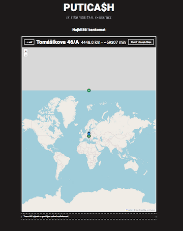
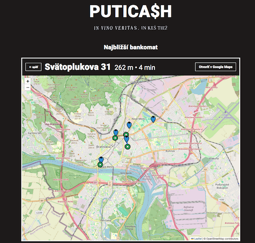

### PUTICA$H

# Bug report

- [BUG_SM-02 Výber baru a otvorenie mapy](#bug_sm-02-výber-baru-a-otvorenie-mapy)
- [BUG_SM-07 Responzivita](#bug_sm-07-responzivita)
- [BUG_001x Mapa neodstraňuje predchádzajúce markery po zmene výberu baru](#bug_001x_mapa_neodstraňuje_predchádzajúce_markery_po_zmene_výberu_baru)

---
---

# BUG_SM-02 Výber baru a otvorenie mapy

**ID:** BUG_SM02  
**Súvisiaci Test Case:** SM-02 (Výber baru a otvorenie mapy), SM-03 (Zobrazenie trasy)  
**Priorita:** Vysoká  
**Závažnosť:** Vysoká (nesprávne vykreslenie trasy a metrík, znižuje funkčnosť aplikácie)  
**Status:** Open  

**Názov:** 
Chybná poloha ATM a nesprávne metriky pri bare "Trnavská c.“  

**Popis:**  
Pri výbere baru „Trnavská c.“ sa Leaflet mapa síce načíta a zobrazuje 2 markery (bar a ATM), ale marker ATM sa nachádza na nesprávnej polohe.  
V notice banneri sa zároveň zobrazí chybová hláška o zlyhaní Directions API a v hornom toolbare sú zobrazené nesprávne (extrémne) hodnoty vzdialenosti (4448.0 km) a času (59307 min).  

**Kroky na reprodukciu:**  
1. Otvor aplikáciu: https://puticash.netlify.app/  
2. Na úvodnom screene klikni na bar **„Trnavská c.“**  
3. Sleduj mapový screen:  
   - Over pozíciu ATM markeru.  
   - Sleduj notice banner pod mapou.  
   - Sleduj toolbar nad mapou (vzdialenosť a čas).  

**Očakávaný výsledok:**  
- Na mape sa zobrazia dva markery (bar a ATM) podľa súradníc v `bars.json` a `atms.json`.  
- Notice banner sa nezobrazuje pri úspešnom výpočte.  
- Toolbar nad mapou zobrazuje korektnú vzdialenosť a čas trasy.  

**Skutočný výsledok:**  
- ATM marker sa zobrazuje na nesprávnej polohe.  
- Notice banner zobrazuje hlášku "Trasa API zlyhala – použijem odhad vzdialenosti"
- Toolbar nad mapou zobrazuje chybné, extrémne metriky (vzdialenosť 4448.0 km, čas 59307 min).  

**Environment:**  
- OS: macOS Sierra 10.12.6
- Browser: Chrome 103.0.5060.134, Firefox 115.28.0esr
- URL: https://puticash.netlify.app/  

**Screenshot / Video:**  
  

**Návrh na fix:**  
- Skontrolovať korektnosť párovania bar–ATM v `bars.json` a `atms.json`.  
- Overiť spracovanie a správnosť súradníc pri výbere baru „Trnavská c.“  
- Overiť, či Directions API request obsahuje správne parametre a či fallback správne určuje ATM.  

---

# BUG_SM-07 Responzivita

**ID:** BUG_SM07  
**Súvisiaci Test Case:** SM-07 (Responzivita)  
**Priorita:** Stredná  
**Závažnosť:** Stredná   
**Status:** Open  

**Názov:**
Tlačidlo „Otvoriť v Google Maps“ preteká za hranicu kontajnera pri šírke 601–671px  

**Popis:**  
Pri testovaní responzivity zobrazenia mapy baru "Vajnorská" sa na jeho mapovom screene zistilo, že v mobilnom rozlíšení pri šírke medzi 601px a 671px tlačidlo „Otvoriť v Google Maps“ vychádza mimo pravý okraj kontajnera Leaflet mapy. Tlačidlo sa vracia do správnej polohy pri šírke ≥683px. 

**Kroky na reprodukciu:**  
1. Otvor aplikáciu: https://puticash.netlify.app/  
2. Aktivuj Developer Tools → Device Toolbar  
3. Nastav šírku zobrazenia na hodnotu medzi **601px a 671px**
4. Vyber bar "Vajnorská" a prejdi na mapový screen
5. Sleduj tlačidlo „Otvoriť v Google Maps“ v hornej časti nad mapou

**Očakávaný výsledok:**  
- Tlačidlo je vždy zarovnané a viditeľné v rámci kontajnera.  
- UI zostáva konzistentné vo všetkých rozlíšeniach.  

**Skutočný výsledok:**  
- Tlačidlo „Otvoriť v Google Maps“ sa v intervale šírok 601–671px zobrazuje posunuté doprava, mimo kontajner.  
- UI sa opraví až pri šírke ≥683px.  

**Environment:**  
- OS: macOS Sierra 10.12.6
- Browser: Chrome 103.0.5060.134, Firefox 115.28.0esr
- Device Toolbar (mobilná simulácia)  
- URL: https://puticash.netlify.app/ 

**Screenshot:**  
  

**Návrh na fix:**  
- Pridať CSS pravidlo pre kritický breakpoint (napr. `@media (max-width: 671px) { ... }`) a zabezpečiť, aby tlačidlo ostalo v rámci kontajnera.  

---
# BUG_001x Mapa neodstraňuje predchádzajúce markery po zmene výberu baru    

**ID:** BUG_001x

**Súvisiaci Test Case:** SM-02 (Výber baru a otvorenie mapy), SM-03 (Zobrazenie trasy)  

**Priorita:** Nízka

**Závažnosť:** Nízka (UI / Map rendering)

**Status:** Open  

**Názov:**  
Mapa ponecháva markery z predchádzajúcich výberov barov počas jednej session  

**Popis:**  
Pri opakovanom výbere barov v rámci jednej session sa na mape zobrazia nové markery baru a ATM, avšak markery z predchádzajúcich výberov ostávajú na mape.  
Problém je viditeľný najmä pri oddialení (zoom-out), kedy sú markery z predchádzajúcich výberov stále prítomné.  

**Kroky na reprodukciu:**  
1. Otvor aplikáciu: https://puticash.netlify.app/  
2. Na úvodnom screene vyber ľubovoľný bar  
3. Sleduj mapu s vykreslenými markermi baru a ATM  
4. Klikni na tlačidlo "Späť" a vyber iný bar  
5. Znova sleduj mapu – zobrazia sa nové markery baru a ATM  
6. Použi zoom-out a over, či sú stále viditeľné markery z predchádzajúceho výberu  
7. Opakuj postup s viacerými barmi  

**Očakávaný výsledok:**  
- Po každom výbere baru sú na mape zobrazené len aktuálne markery baru a ATM.  
- Markery z predchádzajúcich výberov sa už nezobrazujú.  

**Skutočný výsledok:**  
- Pri oddialení mapy sú viditeľné aj markery z predchádzajúcich výberov barov a ATM.  
- Tento stav pretrváva počas celej session.  

**Environment:**  
- OS: macOS Sierra 10.12.6  
- Browser: Chrome 103.0.5060.134, Firefox 115.28.0esr  
- URL: https://puticash.netlify.app/  

**Screenshot:**  
 

---  
