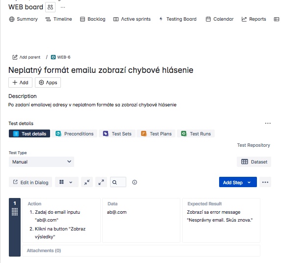
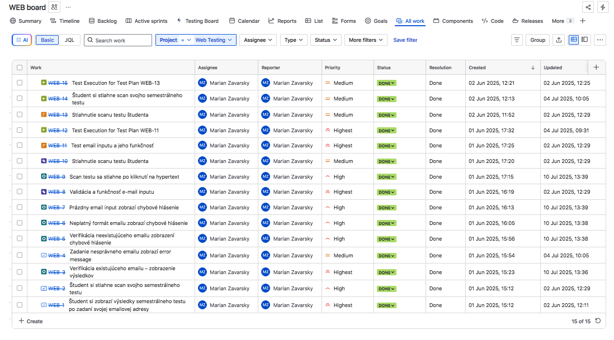
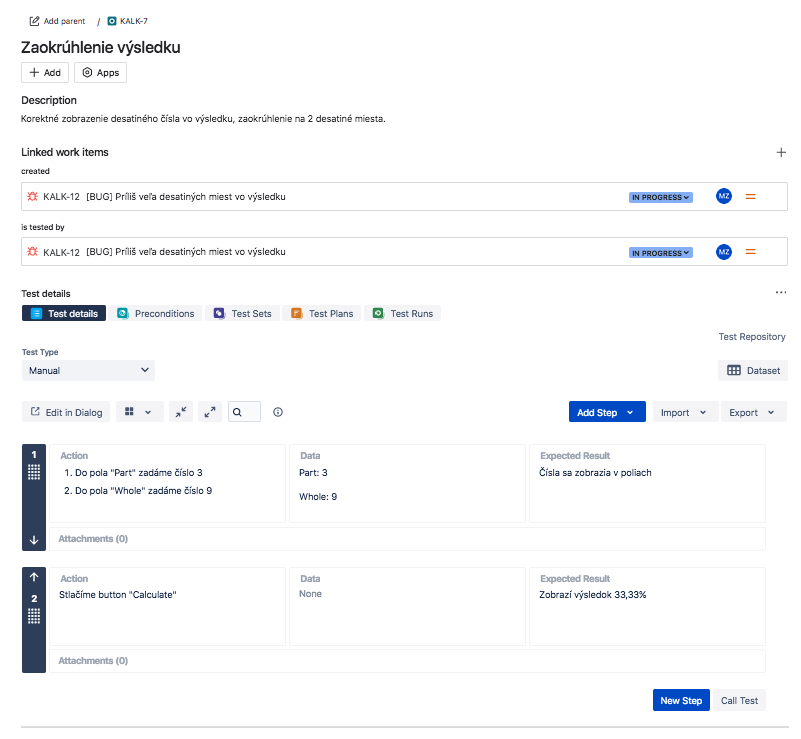
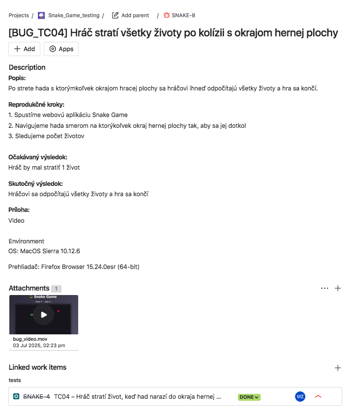
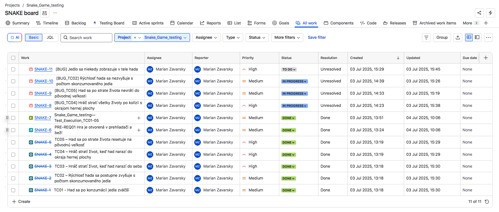

# QA Demo Projects – Portfólio manuálneho testovania

Vitajte v mojom repozitári s ukážkovými QA projektmi, ktoré som vytvoril ako súčasť môjho záujmu o oblasť softvérového testovania. Každý projekt vznikol ako samostatné cvičenie v manuálnom testovaní – od návrhu testovacích prípadov až po ich exekúciu a reportovanie chýb v JIRA/Xray.

Tieto projekty demonštrujú môj praktický prístup k testovaniu a dôraz na systematickosť, dokumentáciu a kontext. Niektoré aplikácie vznikli pôvodne ako reálne nástroje na praktické využitie, iné ako cielené cvičenia v oblasti QA.

**Každý projekt obsahuje kompletnú dokumentáciu vo forme samostatných súborov s testovacími prípadmi a bug reportami vo formáte Markdown, doplnený o dôkazový materiál (screenshoty, prípadne video).**

---

## Prehľad projektov

### PUTICA$H

Webová aplikácia, ktorá pomáha zákazníkom obľúbeného bratislavského podniku rýchlo nájsť najbližší bankomat. Po výbere baru z úvodného zoznamu sa zobrazí mapa s markerom baru, markerom bankomatu a trasou chôdze vrátane odhadovaného času a vzdialenosti.Aplikácia podporuje fallback výpočet pri zlyhaní Directions API a obsahuje základné QA testy (smoke testovacie prípady, traceability matrix, bug reporty...) ako súčasť demo projektu.

- [README projektu](./PUTICASH/README.md)

- **Testovanie:** správne načítanie a zobrazovanie dát z JSON súborov, integráciu s Google Directions API, spracovanie fallback výpočtov pri zlyhaní API, ako aj UI/UX prvky vrátane responzivity a navigácie medzi obrazovkami

- **Testovacie prípady:** 9 – pokrývajú načítanie a výber barov, zobrazenie mapy s markermi, výpočet a fallback trasy, deeplink do Google Maps, návrat na zoznam barov, responzivitu a obmedzenia API kľúča
- **Stav:** /testovanie v pláne/

### WEB Výsledky hodnotenia

Webová aplikácia, ktorá umožňuje študentom po zadaní emailu zobraziť výsledky semestrálneho testu a stiahnuť jeho scan. Projekt pôvodne slúžil ako nástroj pre mojich študentov kurzu *Solfeggio* na Vysokej škole múzických umení, neskôr som ho adaptoval ako QA demoprojekt.

- [README projektu](./WEB_Výsledky_hodnotenia/README.md)

- **Testovanie:** verifikácia emailov, reakcie systému na vstupy, funkčnosť sťahovania
- **Testovacie prípady:** 5
- **Stav:** všetky testy prešli


**Ukážka testovacieho prípadu**

```plaintext
Testovací Prípad TC03 – Neplatný formát emailu zobrazí chybové hlásenie

Súvisiaca BR: BR-1  
Priorita: Vysoká  

Popis:
Po zadaní emailovej adresy v neplatnom formáte sa zobrazí chybové hlásenie

PRE-REQ:
Stránka je načítaná

Data:  
abc@.com

Kroky:  
1. Zadaj do email inputu "ab@.com"
2. Klikni na button "Zobraz výsledky"  

Očakávaný výsledok:  
Zobrazí sa chybové hlásenie "Nesprávny email. Skús znova."  

Skutočný výsledok:
Zobrazil sa chybové hlásenie "Nesprávny email. Skús znova."  

Stav:
Passed  

```

**Ukážka práce v JIRA/Xray:**





---

### Kalkulačka percent

Jednoduchá aplikácia na výpočet percenta. Vytvorená s úmyselnými chybami, ktoré som následne testoval a dokumentoval v rámci QA scenárov.

- [README projektu](./Kalkulacka_percent/README.md)

- **Testovanie:** výpočtová logika, chybové vstupy, UI/UX správanie
- **Testovacie prípady:** 6
- **Bug reporty:** 4


**Ukážka bug reportu**

```plaintext

[BUG] – Príliš veľa desatinných miest vo výsledku

Súvisiaci test: TC_06  
Priorita: Nízka  
Závažnosť: Stredná

Popis:
Výsledok s desatinnými číslami nie je nastavený na zaokrúhľovanie a obsahuje viac ako 10 desatinných miest.

Očakávaný výsledok:  
Zobrazí sa zaokrúhlený výsledok na 2 desatiné miesta (napr. 3.33%)

Skutočný výsledok:  
Zobrazí sa výsledok s nadbytočným množstvom desatinných miest (napr. 33.33333333333333%)

Kroky na reprodukciu:  

  1. Spustíme webovú aplikáciu kalkulačky  
  2. Do poľa "Part" napíšeme 3  
  3. Do poľa "Whole" napíšeme 9  
  4. Stlačíme tlačidlo "Calculate"

Navrhované riešenie:
Odporúčam doplniť funkciu toFixed(2).

Environment:

OS: MacOs Sierra 10.12.6
Prehliadač: Firefox Browser 15.24.0esr (64-bit)

Dôkaz:  
(./screenshots/KALK_Bug_desatine_miesta.png)
  
```

**Ukážka práce v JIRA/Xray:**




---

### Snake Game

Webová verzia klasickej hry Snake s nasimulovanými chybami. Slúži ako cvičenie z testovania UI, kolízií, pohybu a reakcií systému. Obsahuje aj video dôkaz bugu.

- [README projektu](./Snake_game/README.md)

- **Testovanie:** logika hry, kolízie, vizuálna odozva
- **Testovacie prípady:** 6
- **Bug reporty:** 5

**Ukážka bug reportu**

```plaintext
[BUG_TC04] – Hráč stratí všetky životy po kolízii s okrajom hernej plochy

Súvisiaci test: TC04  
Súvisiaca požiadavka: BR-4  
Priorita: Vysoká  
Závažnosť: Vysoká

Popis:
Had sa po strate života nevráti do svojej pôvodnej veľkosti 3 blokov a pokračuje ďalej v nadobudnutej veľkosti.

Očakávaný výsledok:
Hráč by mal stratiť 1 život

Skutočný výsledok:
Hráčovi sa odpočítajú všetky životy a hra sa končí

Kroky na reprodukciu:
  1. Spustíme webovú aplikáciu Snake Game
  2. Navigujeme hada na okraj hernej plochy tak, aby sa jej dotkol
  3. Sledujeme počet životov 

Dôkaz:
[Video MOV](./screenshots/Snake_Game_BUG_TC04.mov)
```

**Ukážka práce v JIRA/Xray:**





---
---

## Použité nástroje a technológie

- **Test management:** JIRA + Xray  
- **Bug tracking:** Screenshoty, videozáznamy, komentáre  
- **Dokumentácia:** Markdown (testovacie prípady, bug reporty)  
- **Typ testovania:** Manuálne  
- **Testovacie prostredie:** macOS Sierra, Firefox ESR  
- **Editor kódu:** Visual Studio Code  
- **Nasadenie webu:** Netlify

---


## Cieľ repozitára

Tento repozitár dokumentuje moje prvé QA projekty. Demonštruje schopnosť navrhovať testy, odhaľovať chyby a pracovať s nástrojmi ako JIRA/Xray v rámci systematického prístupu k testovaniu.


---

## Autor

**Marián Zavarský**  
GitHub: [github.com/MarZav-5](https://github.com/MarZav-5)  
LinkedIn: [linkedin.com/in/marian-zavarsky-13128a1ab](https://www.linkedin.com/in/marian-zavarsky-13128a1ab/)
