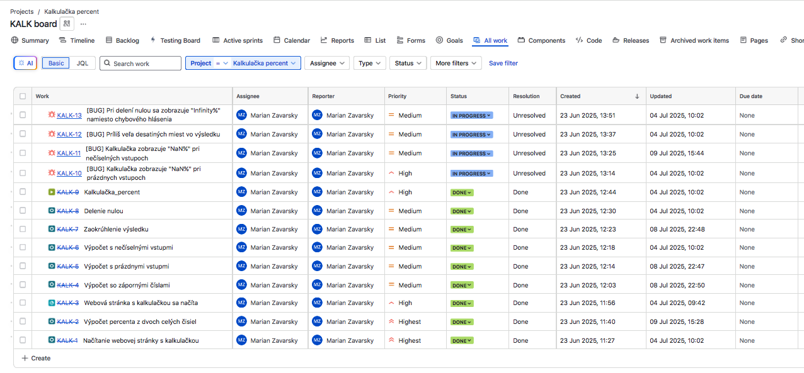

# QA Projects – Portfólio manuálneho testovania

Vitajte v mojom repozitári s ukážkovými QA projektmi, ktoré som vytvoril ako súčasť môjho záujmu o oblasť softvérového testovania. Každý projekt vznikol ako samostatné cvičenie v manuálnom testovaní – od definovania business požiadaviek, cez návrh a spustenie testovacích prípadov, až po evidenciu bug reportov.

Tieto projekty demonštrujú môj praktický prístup k testovaniu a dôraz na systematickosť, dokumentáciu a kontext. Obsahuje niekoľko webových aplikácií, ktoré som vytvoril s pomocou ChatGPT a podľa potreby ďalej upravoval vo Visual Studio Code. Pri tvorbe som nechal GPT zakomponovať do kódu náhodné chyby, ktoré som následne objavil pri testovaní. 

**Projekty obsahujú dokumentáciu vo forme samostatných súborov vo formáte Markdown, doplnený o dôkazový materiál (screenshoty, prípadne video). Niektoré projekty som spracoval aj v nástrojoch v Jira / Xray s cieľom simulácie reálneho prostredia**

---

## Prehľad projektov

# PUTICA$H
<p align="left">
  
  
</p>

Webová aplikácia, ktorá pomáha zákazníkom obľúbeného bratislavského podniku rýchlo nájsť najbližší bankomat. Po výbere baru z úvodného zoznamu sa zobrazí mapa s markerom baru, markerom bankomatu a trasou chôdze vrátane odhadovaného času a vzdialenosti. Aplikácia podporuje fallback výpočet pri zlyhaní Directions API. Projekt obsahuje základné QA testy (smoke testovacie prípady na overenie základnej použiteľnosti, traceability matrix, bug reporty...) ako súčasť demo projektu.

- [README projektu](./PUTICASH/README.md)

- **Testovanie:** správne načítanie a zobrazovanie dát z JSON súborov, integráciu s Google Directions API, spracovanie fallback výpočtov pri zlyhaní API, UI/UX prvky vrátane responzivity a navigácie medzi obrazovkami

- **Testovacie prípady:** 9 – pokrývajú načítanie a výber barov, zobrazenie mapy s markermi, výpočet a fallback trasy, deeplink do Google Maps, návrat na zoznam barov, responzivitu a obmedzenia API kľúča
- **Stav:** testované, viac v README projektu


**Ukážka testovacieho prípadu**

```plaintext
Testovací prípad SM-03

ID: SM-03
Názov: Zobrazenie trasy
Súvisiaca BR: BR-01, BR-03
Priorita: Vysoká

Popis:
Na screene s mapou sa vykreslí pešia trasa medzi vybraným barom a prislúchajúcim ATM. Používateľ v paneli nad mapou vidí metriky vzdialenosť a čas. 

PRE-REQ:
-  Postupne vybraný každý bar z úvodného screenu
-  Mapový screen s Leaflet mapou je zobrazený

Test dáta:
-  URL: https://puticash.netlify.app/

Kroky:
1. Over, že sa na #mapScreen načítala Leaflet mapa
2. Skontroluj vykreslenie 2 markerov – jeden pre bar, druhý pre ATM
3. Skontroluj, či je medzi markerom baru a ATM vykreslená polyline trasa
4. Over, že v toolbare nad mapou sú zobrazené správne metriky:
    – vzdialenosť v m/km (napr. 220 m)
    - čas v minútach (napr. 2 min)

Očakávaný výsledok:
-  Na mape sa vykreslí polyline trasa medzi 2 markermi – barom a atm
-  Na toolbar paneli nad mapou sú zobrazené metriky: vzdialenosť (m/km) a čas (min)

Skutočný výsledok:
- Na mape každého baru sa vykreslila polyline trasa medzi 2 markermi, okrem baru "Trnavská c."
- Na toolbar paneli nad mapu sa zobrazili metriky vzdialenosti a času.
- Po kliknutí na bar "Trnavská c." sa na Leaflet mape vykreslí chybná poloha ATM:
   - notice bar zobrazí chybovú hlášku "Trasa API zlyhala - použijem odhad vzdialenosti"
   - vrchný toolbar zobrazuje chybnú vzdialenosť v km a časový odhad v min. 

Poznámka:
-  V prípade nedostupnosti Google Directions API, viď SM-04 "Fallback výpočet"

Stav:
Failed

Súvisiaci BUG Report:
[BUG_SM-02 Výber baru a otvorenie mapy]

Time stamp:
09/10/25 10:20

```
---

# WEB Výsledky hodnotenia

<p align="left">
  
  
</p>

Webová aplikácia, ktorá umožňuje študentom po zadaní emailu zobraziť výsledky semestrálneho testu a stiahnuť jeho scan. Projekt pôvodne slúžil ako nástroj pre mojich študentov kurzu *Solfeggio* na Vysokej škole múzických umení, neskôr som ho adaptoval ako QA demoprojekt.

- [README projektu](./WEB_Výsledky_hodnotenia/README.md)

- **Testovanie:** verifikácia emailov, reakcie systému na vstupy, funkčnosť sťahovania
- **Testovacie prípady:** 5
- **Stav:** všetky testy prešli


**Ukážka testovacieho prípadu**

```plaintext
Testovací Prípad TC01 – Verifikácia existujúceho emailu – zobrazenie výsledkov
Súvisiaca BR: BR-1
Priorita: Vysoká

Popis:
Po zadaní emailovej adresy, existujúcej v databáze sa zobrazia semestrálne výsledky študenta na ďalšej sekcii stránky, prerolovaním smerom dole.
PRE-REQ:
- Email existuje v databáze
- Stránka je načítaná

Data:
- student1@example.com
- student2@example.com

Kroky:
1. Zadaj existujúci email "student1@example.com"
2. Klikni na button "Zobraz výsledky"
3. Postup opakuj s druhým emailom "student2@example.com"

Očakávaný výsledok:
- Dáta sa zobrazia na ďalšej sekcii stránky po prerolovaní smerom dole.

Skutočný výsledok:
- Dáta sú zobrazené na ďalšej sekcii stránky po prerolovaní smerom dole.

Stav:
Passed
```

**Ukážka práce v JIRA/Xray:**


---

# Kalkulačka percent

<p align="left">
  
</p>

Jednoduchá aplikácia na výpočet percent. Je vytvorená s úmyselnými chybami, ktoré som následne testoval a dokumentoval v rámci QA scenárov.

- [README projektu](./Kalkulacka_percent/README.md)

- **Testovanie:** výpočtová logika, chybové vstupy, UI/UX správanie
- **Testovacie prípady:** 6
- **Bug reporty:** 4


**Ukážka bug reportu**

```plaintext

[BUG] – Príliš veľa desatinných miest vo výsledku

Súvisiaci test: TC_06  
Priorita: Nízka  
Závažnosť: Stredná

Popis:
Výsledok s desatinnými číslami nie je nastavený na zaokrúhľovanie a obsahuje viac ako 10 desatinných miest.

Očakávaný výsledok:  
Zobrazí sa zaokrúhlený výsledok na 2 desatiné miesta (napr. 3.33%)

Skutočný výsledok:  
Zobrazí sa výsledok s nadbytočným množstvom desatinných miest (napr. 33.33333333333333%)

Kroky na reprodukciu:  

  1. Spustíme webovú aplikáciu kalkulačky  
  2. Do poľa "Part" napíšeme 3  
  3. Do poľa "Whole" napíšeme 9  
  4. Stlačíme tlačidlo "Calculate"

Navrhované riešenie:
Odporúčam doplniť funkciu toFixed(2).

Environment:

OS: MacOs Sierra 10.12.6
Prehliadač: Firefox Browser 15.24.0esr (64-bit)

Dôkaz:  
(./screenshots/KALK_Bug_desatine_miesta.png)
  
```

**Ukážka práce v JIRA/Xray:**




---

# Snake Game

<p align="left">
  
</p>


Webová verzia klasickej hry Snake s nasimulovanými chybami. Slúži ako cvičenie z testovania UI, kolízií, pohybu a reakcií systému. Obsahuje aj video dôkaz bugu.

- [README projektu](./Snake_game/README.md)

- **Testovanie:** logika hry, kolízie, vizuálna odozva
- **Testovacie prípady:** 6
- **Bug reporty:** 5

**Ukážka bug reportu**

```plaintext
[BUG_TC04] – Hráč stratí všetky životy po kolízii s okrajom hernej plochy

Súvisiaci test: TC04  
Súvisiaca požiadavka: BR-4  
Priorita: Vysoká  
Závažnosť: Vysoká

Popis:
Had sa po strate života nevráti do svojej pôvodnej veľkosti 3 blokov a pokračuje ďalej v nadobudnutej veľkosti.

Očakávaný výsledok:
Hráč by mal stratiť 1 život

Skutočný výsledok:
Hráčovi sa odpočítajú všetky životy a hra sa končí

Kroky na reprodukciu:
  1. Spustíme webovú aplikáciu Snake Game
  2. Navigujeme hada na okraj hernej plochy tak, aby sa jej dotkol
  3. Sledujeme počet životov 

Dôkaz:
[Video MOV](./screenshots/Snake_Game_BUG_TC04.mov)
```

**Ukážka práce v JIRA/Xray:**


---
---

## Použité nástroje a technológie

- **Test management:** JIRA + Xray  
- **Bug tracking:** Screenshoty, videozáznamy, komentáre  
- **Dokumentácia:** Markdown (testovacie prípady, bug reporty)  
- **Typ testovania:** Manuálne  
- **Testovacie prostredie:** macOS Sierra, Chrome, Firefox ESR, localhost
- **Editor kódu:** Visual Studio Code  
- **Nasadenie webu:** Netlify

---


## Cieľ repozitára

Tento repozitár dokumentuje moje prvé QA projekty. Demonštruje schopnosť navrhovať testy, odhaľovať chyby a pracovať s nástrojmi ako JIRA/Xray v rámci systematického prístupu k testovaniu.


---

## Autor

**Marián Zavarský**  
GitHub: [github.com/MarZav-5](https://github.com/MarZav-5)  
LinkedIn: [linkedin.com/in/marian-zavarsky-13128a1ab](https://www.linkedin.com/in/marian-zavarsky-13128a1ab/)
