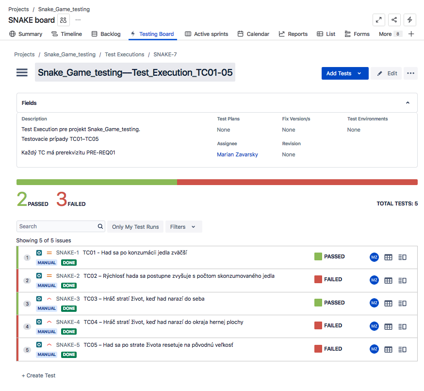

# Snake Game – QA Testing Project

Tento projekt slúži ako ukážka manuálneho testovacieho procesu v rámci UI a logiky hry na jednoduchej webovej hre Snake. 

Zameriava sa na testovanie podľa business požiadaviek, tvorbu testovacích prípadov, zaznamenávanie chýb a ich spracovanie v JIRA / Xray systéme. 

Hru som vytvoril s pomocou ChatGPT, ktorý do kódu zámerne implementoval chyby na účely testovania. 


---

## Zhrnutie projektu

- **Zameranie:** funkčné testovanie webovej hry
- **Testovacie prípady:** 5 prípadov navrhnutých podľa špecifikovaných požiadaviek
- **Nájdené chyby:** 4 bugy s rôznou prioritou a závažnosťou
- **Použité nástroje:** JIRA / Xray, Markdown, manuálne testovanie
- **Priložené súbory:**
  - [Testovacie prípady](./Snake_Game_Testovacie_Pripady.md)
  - [Bug reporty](./Snake_Game_Bug_Report.md)

---

## Ukážka testovacieho prípadu

```plaintext
TC02 – Rýchlosť hada sa postupne zvyšuje s počtom skonzumovaného jedla

PRE-REQ:
- Herná stránka je otvorená v prehliadači  
- Hra je spustená a beží  

Kroky:
1. Naviguj hada k jedlu a nechaj ho zjesť
2. Opakuj krok 1 viackrát (aspoň 5–10x)
3. Sleduj rýchlosť hada po každom skonzumovanom jedle

Očakávaný výsledok:
- Konzumáciou jedla by sa mala rýchlosť hada postupne zvyšovať

Skutočný výsledok:
- Rýchlosť hada sa konzumáciou jedla nezvyšuje

Stav:
Failed

Referencia na bug: 
[BUG_TC02 – Rýchlosť hada sa nezvyšuje](./Bug_Report.md#bug_tc02--rýchlosť-hada-sa-nezvyšuje-po-konzumácii-jedla)

```

---

## Ukážka bug reportu

```plaintext
BUG_TC04 – Hráč stratí všetky životy po kolízii s okrajom hernej plochy

Súvisiaci test: TC04  
Súvisiaca požiadavka: BR-4  
Priorita: Vysoká  
Závažnosť: Vysoká

Očakávané výsledok:
 - Hráč by mal stratiť 1 život

Skutočné výsledok:
 - Hráčovi sa odpočítajú všetky životy a hra sa končí

Kroky na reprodukciu:
1. Spustíme webovú aplikáciu Snake Game
2. Navigujeme hada smerom na ktorýkoľvek okraj hernej plochy tak, aby sa jej dotkol
3. Sledujeme počet životov 

Stav:  
Open

Video dôkaz:
[Video MOV](./screenshots/Snake_Game_BUG_TC04.mov)

Príloha:

```

---

## Business požiadavky

1. Had sa po konzumácii jedla zväčší  
2. Rýchlosť hada sa zvyšuje s každým jedlom  
3. Hráč stratí 1 život po kolízii so sebou  
4. Hráč stratí 1 život po kolízii s okrajom  
5. Po strate života sa had vráti na pôvodnú veľkosť  

---

## Ukážka práce v JIRA / Xray





---

## Odkazy

- [Testovacie prípady (Markdown)](./Snake_Game_Testovacie_Pripady.md)  
- [Bug reporty (Markdown)](./Snake_Game_Bug_Report.md)

---

## Autor

**Marian Zavarský**   
GitHub: [github.com/tvoj_username](https://github.com/tvoj_username)  
LinkedIn: [linkedin.com/in/marian-zavarsky-13128a1ab](https://linkedin.com/in/marian-zavarsky-13128a1ab)

---
