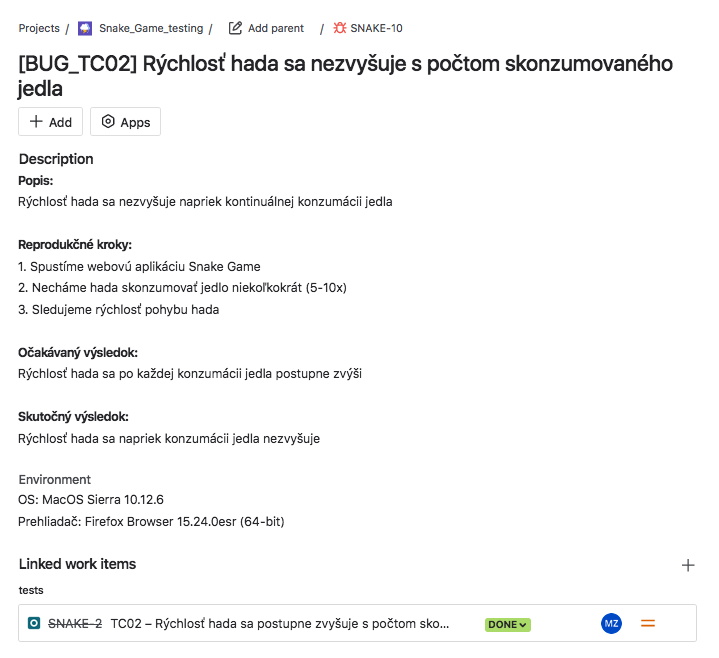
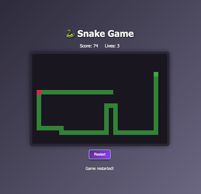

# Snake Game – Bug reporty

## [BUG_TC02] – Rýchlosť hada sa nezvyšuje po konzumácii jedla

**Súvisiaci test:** TC02  
**Súvisiaca požiadavka:** BR-2  
**Priorita:** Stredná  
**Závažnosť:** Stredná 

**Popis:**
- Rýchlosť hada sa nezvyšuje napriek kontinuálnej konzumácii jedla

**Očakávaný výsledok:**  
- Rýchlosť hada sa po každej konzumácii jedla postupne zvýši

**Skutočný výsledok:**  
- Rýchlosť hada sa napriek konzumácii jedla nezvyšuje

**Kroky na reprodukciu:**

  1. Spustíme webovú aplikáciu Snake Game
  2. Necháme hada skonzumovať jedlo niekoľkokrát (5-10x)
  3. Sledujeme rýchlosť pohybu hada

**Environment:**

- OS: MacOs Sierra 10.12.6
- Prehliadač: Firefox Browser 15.24.0esr (64-bit)
  
**Príloha [Jira / Xray]:**
  
  

---

## [BUG_TC04] – Hráč stratí všetky životy po kolízii s okrajom hernej plochy

**Súvisiaci test:** TC04  
**Súvisiaca požiadavka:** BR-4  
**Priorita:** Vysoká  
**Závažnosť:** Vysoká

**Popis:**
– Po strete hada s ktorýmkoľvek okrajom hracej plochy sa hráčovi ihneď odpočítajú všetky životy a hra sa končí.

**Očakávané výsledok:**  
- Hráč by mal stratiť 1 život

**Skutočné výsledok:**  
- Hráčovi sa odpočítajú všetky životy a hra sa končí

**Kroky na reprodukciu:**

  1. Spustíme webovú aplikáciu Snake Game
  2. Navigujeme hada smerom na ktorýkoľvek okraj hernej plochy tak, aby sa jej dotkol
  3. Sledujeme počet životov 

**Environment:**
- OS: MacOs Sierra 10.12.6
- Prehliadač: Firefox Browser 15.24.0esr (64-bit)

**Dôkaz:**
  [Video MOV](./screenshots/Snake_Game_BUG_TC04.mov)

**Príloha [Jira / Xray]:**
  
  

---

## [BUG_TC05] – Had sa po strate života nevráti do pôvodnej veľkosti

**Súvisiaci test:** TC05  
**Súvisiaca požiadavka:** BR-5  
**Priorita:** Vysoká  
**Závažnosť:** Stredná 

**Očakávané výsledok:**  
- Hráč stráca život a had sa vráti do pôvodnej veľkosti 3 blokov

**Skutočné výsledok:**  
- Hráč stráca život, had ostáva v nadobudnutej veľkosti

**Kroky na reprodukciu:**
 
  1. Spustíme webovú aplikáciu Snake Game 
  2. Necháme hada zjesť niekoľko jedál
  3. Spôsobíme stratu života nárazom do seba  
  4. Sledujeme veľkosť hada po obnovení hry

**Environment:**
- OS: MacOs Sierra 10.12.6
- Prehliadač: Firefox Browser 15.24.0esr (64-bit)
   
---

## [BUG] – Jedlo sa niekedy zobrazuje v tele hada

**Súvisiaci test:** –
**Súvisiaca požiadavka:** –
**Priorita:** Vysoká  
**Závažnosť:** Vysoká

**Popis:** 
Jedlo pre hada sa niekedy zobrazí aj v rámci blokov jeho tela, čo by pri konzumácii spôsobilo stratu života

**Očakávané výsledok:**  
- Jedlo sa nikdy nezobrazí v rámci tela hada

**Skutočné výsledok:**  
- Jedlo sa niekedy zobrazí v rámci tela hada

**Kroky na reprodukciu:**
 
  1. Spustíme webovú aplikáciu Snake Game 
  2. Hráme hru 
  3. Sledujeme zobrazovanie jedla na hracej ploche

**Environment:**
- OS: MacOs Sierra 10.12.6  
- Prehliadač: Firefox Browser 15.24.0esr (64-bit)

**Dôkaz:**

  
