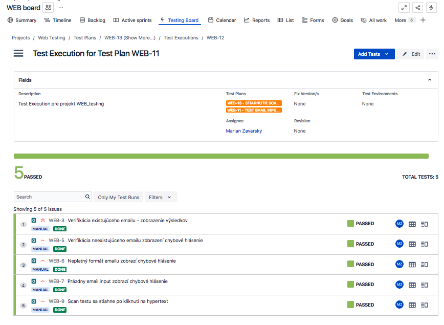

# WEB_Vysledky_hodnotenia – QA Testing projekt

Tento projekt demonštruje manuálne testovanie jednoduchej webovej aplikácie, ktorá umožňuje používateľom zobraziť výsledky semestrálneho testu po zadaní emailovej adresy a následne si stiahnuť scan svojho testu.

Testovanie je zamerané na **verifikáciu emailového vstupu**, **správne reakcie systému na rôzne typy vstupov** (platné, neplatné, neexistujúce) a **funkčnosť odkazu na stiahnutie súboru**. Pokrýva pozitívne, negatívne aj hraničné scenáre (edge cases).

Web bol pôvodne vytvorený ako pomôcka pre študentov na Vysokej škole múzických umení (kurz Solfeggio), kde som pôsobil. Neskôr som ju upravil a doplnil o testovaciu dokumentáciu ako ukážkový QA projekt.

---

## Zhrnutie projektu

- **Zameranie:** funkčné testovanie webovej aplikácie
- **Testovacie prípady:** 5 manuálnych testovacích prípadov
- **Nájdené chyby:** žiadne – všetky testy prešli úspešne
- **Použité nástroje:** JIRA / Xray, manuálne testovanie, Visual Studio Code, Netlify, GitHub
- **Testovacie prostredie:** MacOS Sierra, Firefox ESR
- **Priložené súbory:**
  - [Testovacie prípady](./Web_Testovacie_Pripady.md)

---

## Business požiadavky (BR)

1. Študenti si zobrazia výsledky semestrálneho testu po zadaní svojej emailovej adresy.
2. Študenti si stiahnu scan svojho semestrálneho testu.

---

## Ukážka testovacieho prípadu

```plaintext
Testovací Prípad TC03 – Neplatný formát emailu zobrazí chybové hlásenie

Súvisiaca BR: BR-1  
Priorita: Vysoká  

Popis:
- Po zadaní emailovej adresy v neplatnom formáte sa zobrazí chybové hlásenie

PRE-REQ: 
- Stránka je načítaná

Data:  
- abc@.com

Kroky:
1. Zadaj do email inputu "abc@.com"
2. Klikni na button "Zobraz výsledky"  

Očakávaný výsledok:
- Zobrazí sa chybové hlásenie "Nesprávny email. Skús znova."

Skutočný výsledok:
- Zobrazil sa chybové hlásenie "Nesprávny email. Skús znova."

Stav:
Passed
```

---

## Ukážka práce v JIRA / Xray

  



---

## Odkazy

- [Testovacie prípady (Markdown)](./Web_Testovacie_Pripady.md)

---

## Autor

**Marián Zavarský**  
GitHub: [github.com/MarZav-5](https://github.com/MarZav-5)
